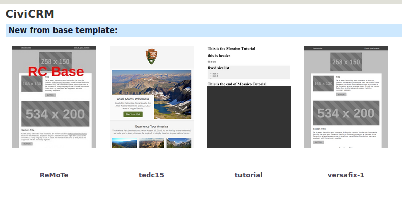
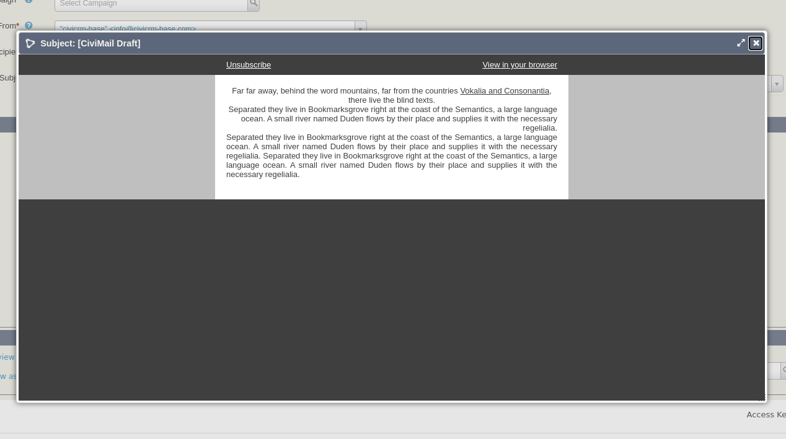

# rc-mosaico-template

[](https://github.com/reflexive-communications/rc-mosaico-template/actions/workflows/main.yml)

This extension installs a new base template to the mosaico email template editor civicrm extension. The template is based on the `versafix-1` template, but the `p` html tags have been replaced with `div`. It was necessary to support the align of the texts. As we experienced, the alignment changes were not applied on the `p` tags. It also provides a new block in the editor for lists.

The extension is licensed under [AGPL-3.0](LICENSE.txt).

## Requirements

-   PHP v7.3+
-   CiviCRM v5.29+
-   uk.co.vedaconsulting.mosaico

## Installation

Sysadmins and developers may clone the [Git](https://en.wikipedia.org/wiki/Git) repo for this extension and
install it with the command-line tool [cv](https://github.com/civicrm/cv).

```bash
git clone git@github.com:reflexive-communications/rc-mosaico-template.git
cv en rc-mosaico-template
```

**New base template**


**The list block**


**Mail preview**

